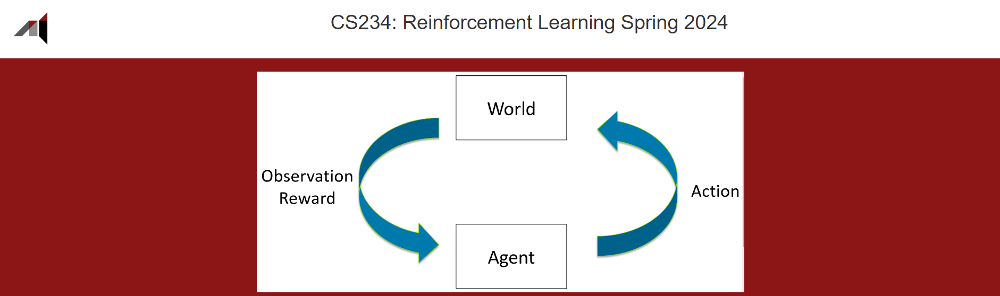

# stanford-cs234



My solutions to [Stanford CS234](https://web.stanford.edu/class/cs234/index.html) problem sets and assignments. Official solutions will be updated as well.

I am planning to make a separate repository for the final project

## installations

```bash
python -m venv cs234
pip install -r requirements.txt
```
or similar installations in each project folder.

## contents

## acknowledgments
